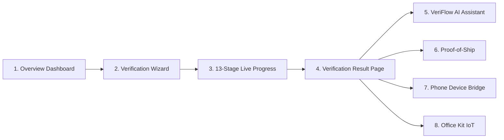

# VeriFlow — AI-Powered Code Verification and Release Control Platform

<div align="center">

```
   __      __        _ ______ _                 
   \ \    / /       (_)  ____| |                
    \ \  / /__ _ __  _| |__  | | _____      __  
     \ \/ / _ \ '__| |  __| | |/ _ \ \ /\ / /  
      \  /  __/ |  | | |    | | (_) \ V  V /   
       \/ \___|_|  |_|_|    |_|\___/ \_/\_/    
```

### **"AI can write it. VeriFlow proves it."**
*An independent, evidence-based verification layer between developers, AI coding assistants, Git repositories, and production deployment environments.*

[](http://localhost:5000)
[](http://localhost:5000)
[](http://localhost:5000)
[](http://localhost:5000)

</div>

---

## 📑 Table of Contents
1. [Product Vision & Core Principle](#-product-vision--core-principle)
2. [End-to-End System Architecture](#-end-to-end-system-architecture)
3. [Page-by-Page Deep Dive & Why We Built It](#-page-by-page-deep-dive--why-we-built-it)
4. [Complicated Technical Terms Explained Simply (With Real-World Analogies)](#-complicated-technical-terms-explained-simply)
5. [The 13-Stage Deterministic Verification Engine](#-the-13-stage-deterministic-verification-engine)
6. [5-Minute Hackathon Demo Script](#-5-minute-hackathon-demo-script)
7. [Comprehensive Technology Stack](#-comprehensive-technology-stack)
8. [Step-by-Step Installation & Running Guide](#-step-by-step-installation--running-guide)
9. [REST API & WebSocket Documentation](#-rest-api--websocket-documentation)

---

## 🌟 Product Vision & Core Principle

AI coding assistants generate code rapidly, but deploying AI code without independent verification exposes applications to critical defects, silent logic regressions, timezone flaws, concurrency races, and security vulnerabilities.

**VeriFlow replaces blind trust with executable evidence.** It operates between the developer, AI assistant, Git repository, and cloud deployment targets to calculate one of three authoritative decisions:

* 🟢 **SHIP** — All required tests passed, zero critical findings, 100% requirement coverage, dependencies verified. Proof-of-Ship certificate issued.
* 🟡 **REVIEW** — Evidence is incomplete, ambiguous requirements, or external sandbox mocks unverified. Requires human sign-off.
* 🔴 **BLOCK** — Critical defect, failed test assertion, security taint vulnerability, or dangerous condition detected. Automatic release halted.

$$\boxed{\textbf{AI suggestions are NOT proof. Executable evidence IS proof.}}$$

---

## 🏗️ End-to-End System Architecture

```mermaid
graph TD
    Client[React 19 + TypeScript + Tailwind Frontend :5173] -->|REST APIs + WebSockets| Server[Node.js + Express Backend :5000]
    Server --> DB[(SQLite / Embedded JSON Store)]
    Server --> Engine[13-Stage Deterministic Verification Pipeline]
    
    subgraph "Verification Pipeline"
        Engine --> S1[1. Repository Sandbox Loader]
        Engine --> S2[2. AI Requirement Extraction REQ-001..4]
        Engine --> S3[3. AST Semantic Code Parser]
        Engine --> S4[4. Git Diff Scope Analyzer]
        Engine --> S5[5. Blast Radius Dependency Graph]
        Engine --> S6[6. Deterministic Test Generator]
        Engine --> S7[7. Static Analysis & Linter]
        Engine --> S8[8. Security Taint Tracking Source-to-Sink]
        Engine --> S9[9. Sandboxed Test Runner]
        Engine --> S10[10. DB Schema & Mock API Verifier]
        Engine --> S11[11. Auditable Evidence Matrix]
        Engine --> S12[12. Transparent Risk Engine]
        Engine --> S13[13. Final Decision: SHIP / REVIEW / BLOCK]
    end

    Engine -->|SHIP| ProofOfShip[Proof-of-Ship Minting Engine & QR]
    Engine -->|BLOCK| Assistant[VeriFlow AI Assistant 3-Step Repair Loop]
    Server --> PhoneBridge[Phone Device Bridge Web Speech API & 1-Tap Approval]
    Server --> OfficeKit[Office Kit Ambient IoT Desk Indicator]
```



---

## 📖 Page-by-Page Deep Dive & Why We Built It



### 1. 📊 Overview Dashboard
* **What it is:** The command center and executive landing screen of the platform.
* **Why we built it:** When an engineering team or individual developer opens the tool, they need an instant, 3-second overview of whether their codebase is safe to release or if releases are currently blocked.
* **What it shows:**
  * **6 Real-time KPI Cards:** Total Projects, Total Verification Runs, Passed runs (SHIP), Blocked runs (BLOCK), Open Critical Issues, and Average Verification Speed (4.8s).
  * **Verification Activity Stream:** A visual timeline graph showing the proportion of clean releases vs. blocked buggy releases over time.
  * **Release Readiness Gate:** An instant visual indicator of whether the staging/production environment is green or blocked by bugs.
  * **Quick Actions:** Direct 1-click access to launch a new verification, connect repositories, or reset the demo.

---

### 2. 🧙‍♂️ New Verification Wizard (5-Step)
* **What it is:** A step-by-step interactive workflow that takes any code or AI suggestion and prepares it for automated verification.
* **Why we built it:** Traditional release tools require writing dozens of lines of bash scripts or complex CI/CD YAML pipelines. The 5-Step Wizard allows anyone (from a beginner to a lead architect) to verify code in under 20 seconds.
* **The 5 Steps Explained:**
  * **Step 1: Select Project** — Pick which codebase you want to test (e.g. *Coupon Checkout Service*).
  * **Step 2: Select Change Context** — Tell VeriFlow what changed: a Pull Request, a Git branch, an uploaded ZIP file, or a manual prompt.
  * **Step 3: Enter Natural Language Requirement** — Enter what the code is *supposed* to do in plain English (e.g., *"Add a coupon discount feature that expires according to the business timezone and cannot be applied twice"*). Includes 1-click presets.
  * **Step 4: Select Verification Rigor Level** — Choose the depth of testing:
    * **Quick Check:** Syntax + AST parser + unit sanity.
    * **Standard Check:** Requirement analysis + impact graph + security taint scan + runtime tests.
    * **Strict Release:** All standard checks + mutation tests + DB schema validation + Proof-of-Ship minting.
  * **Step 5: Start Verification** — Initiates the 13-stage verification pipeline.

---

### 3. ⏱️ 13-Stage Live Progress Screen
* **What it is:** A real-time timeline that visually walks through all 13 stages of the deterministic verification algorithm.
* **Why we built it:** AI coding tools often act like "black boxes" where you have no idea what is happening under the hood. VeriFlow gives you complete transparency with real-time logs and status indicators (Pending $\rightarrow$ Running $\rightarrow$ Passed $\rightarrow$ Failed).
* **The 13 Stages in Simple Words:**
  1. *Repository Loaded:* Grabs the files and prepares an isolated sandbox.
  2. *Requirement Analysis:* AI converts English sentences into numbered acceptance criteria (`REQ-001`..`REQ-004`).
  3. *AST & Code Parsing:* Reads the structure of the code (functions, classes, endpoints).
  4. *Git Diff Analysis:* Finds exact line numbers added, changed, or deleted.
  5. *Dependency & Blast Radius:* Finds all other files and APIs affected by this change.
  6. *Test Suite Generation:* Automatically creates positive, negative, boundary, and security test cases.
  7. *Static Analysis:* Checks syntax, dead code, typing, and invalid imports.
  8. *Security Taint Analysis:* Traces user inputs to make sure they cannot exploit raw database queries or system commands.
  9. *Runtime Sandboxed Test Execution:* Actually runs the code inside an isolated runner and watches what happens.
  10. *Integration & Database Verification:* Checks if database tables and columns match the code.
  11. *Evidence Collection:* Bundles all test proofs into a verifiable matrix.
  12. *Risk Engine Evaluation:* Calculates a mathematical risk score ($0-100$) and enforces hard safety rules.
  13. *Final Decision Generation:* Issues the final verdict: **SHIP**, **REVIEW**, or **BLOCK**.

---

### 4. 🔬 Verification Result Page (9 Tabs)
* **What it is:** The comprehensive, evidence-backed inspection report produced after a verification run.
* **Why we built it:** To prove *why* code was approved or blocked with concrete, executable evidence.
* **The 9 Tabs Explained:**
  * **Tab 1: Summary** — Decision badge (**SHIP** in green, **REVIEW** in amber, **BLOCK** in red), Risk Score, Ship Confidence %, and hard rule violations.
  * **Tab 2: Requirement Coverage** — Shows each requirement (`REQ-001`..`REQ-004`) with a pass/fail badge and link to its test evidence.
  * **Tab 3: Test Results** — Full breakdown of every test run, showing exact durations (in ms), and expandable failure stack traces with line numbers.
  * **Tab 4: Code Impact Graph** — An interactive node-and-edge visual flowchart showing how the changed function connects to the rest of the application.
  * **Tab 5: Security** — Shows the taint flow path from user inputs to database queries.
  * **Tab 6: Runtime Logs** — The raw container console output (stdout/stderr).
  * **Tab 7: Evidence Matrix** — A table linking each business requirement to its proof source.
  * **Tab 8: AI Diagnosis** — AI-generated explanation of the root cause and production impact.
  * **Tab 9: Suggested Fixes** — Side-by-side unified code diff showing the fix with a 1-click **"Apply Fix & Re-Verify"** button.

---

### 5. 🤖 VeriFlow Assistant (Repair Loop Panel)
* **What it is:** A slide-out AI diagnostic panel that answers: *What failed?*, *Why did it fail?*, *What is the impact?*, and *How do I fix it?*.
* **Why we built it:** Instead of forcing the developer to manually hunt down bugs and write patches from scratch, the assistant generates a deterministic fix, presents a unified diff, and lets you re-run the verification pipeline in 1 click.
* **Safety Guardrail:** It limits automatic repair attempts to **3 attempts maximum**, preventing infinite hallucination loops and requiring human review if the bug cannot be fixed cleanly.

---

### 6. 📜 Proof-of-Ship Certificate
* **What it is:** A cryptographically sealed, verifiable release certificate minted whenever a verification run earns a 100% **SHIP** decision.
* **Why we built it:** In regulated industries, enterprise teams, and release management, you need an immutable record proving that code passed all checks before it was deployed to production.
* **Key Elements:**
  * **Certificate ID:** Unique identifier (e.g. `VF-CERT-2026-54263`).
  * **SHA-256 Verification Hash:** A tamper-proof cryptographic fingerprint.
  * **Dynamic QR Code:** Scannable by phone cameras to view the live verification proof.
  * **Checklist Metrics:** Test pass rate, requirement coverage, and security status.
  * **Official Release Disclaimer:** Formal statement of deterministic checks executed.

---

### 7. 📱 Phone Device Bridge
* **What it is:** A mobile companion interface that pairs your smartphone with your active desktop verification session.
* **Why we built it:** Engineering leaders and on-call DevOps engineers need to monitor release gates and authorize deployments from anywhere without sitting at a laptop.
* **Key Capabilities:**
  * **QR Code Pairing:** Connect your phone instantly by scanning the QR code on the desktop.
  * **Voice Commands (Web Speech API):** Speak directly to your phone:
    * *"Explain the latest failure"*
    * *"Show critical issues"*
    * *"What files were affected?"*
    * *"Approve deployment"*
    * *"Show Proof-of-Ship"*
  * **1-Tap Biometric Approval:** One-tap green button to stamp and release verified code.

---

### 8. 💡 Office Kit (IoT Physical Desk Indicator)
* **What it is:** A simulated and hardware-ready ambient desktop device (like an IoT gadget sitting on your office desk) that glows and sounds alarms based on release status.
* **Why we built it:** To bring release status into the physical world. If a teammate merges broken AI code, the physical desk lamp turns pulsing red (**BLOCKED**); when verified, it glows vibrant green (**SHIP / DEPLOYED**).
* **7 Hardware States:** `IDLE`, `VERIFYING`, `PASSED`, `REVIEW REQUIRED`, `BLOCKED`, `APPROVAL REQUIRED`, `DEPLOYED`.
* **Hardware Webhook API:** Provides a standard REST and WebSocket endpoint for physical **ESP32**, **Arduino**, or **Raspberry Pi** microcontrollers.

---

### 9. 🔀 Pull Requests Page
* **What it is:** A GitHub-style PR explorer that demonstrates how VeriFlow integrates with GitHub Actions and Git repositories.
* **Why we built it:** Developers work in Pull Requests. This page simulates the **VeriFlow Release Gate Bot** posting automated audit reports directly into PR discussions.

---

### 10. ⚠️ Issues Page
* **What it is:** A centralized security and bug triage board.
* **Why we built it:** To track all open vulnerabilities, timezone discrepancies, and logic errors across all repositories, complete with severity badges (Critical, High, Medium, Low), line numbers, and 1-click remediation diffs.

---

### 11. 🧪 Test Cases Harness
* **What it is:** A test suite explorer displaying every positive, negative, boundary, regression, and security test case generated by VeriFlow.
* **Why we built it:** To inspect the underlying test code, execution duration in milliseconds, and detailed assertion error messages.

---

### 12. 🔒 Security (Taint Scan)
* **What it is:** A dedicated security vulnerability dashboard.
* **Why we built it:** To visualize data flows and ensure user inputs are sanitized before reaching database queries or operating system commands.

---

### 13. 🔌 Integrations Page
* **What it is:** The connector hub for GitHub, GitLab CI, Slack Release Bot, and Office Kit IoT hardware webhooks.
* **Why we built it:** To connect VeriFlow into existing DevOps and CI/CD pipelines.

---

### 14. ⚙️ Settings & Immutable Audit Log
* **What it is:** Configuration console for risk engine scoring weights and an immutable, tamper-evident log of every verification, approval, and deployment action.
* **Why we built it:** For enterprise compliance, transparency, and traceability.

---

## 🧠 Complicated Technical Terms Explained Simply

| Technical Term | What It Sounds Like | What It Actually Means in Simple Words | Real-World Everyday Analogy |
|---|---|---|---|
| **AST (Abstract Syntax Tree)** | A complex tree in a forest | A blueprint breakdown of your code into its structural pieces (functions, classes, variables, and imports) so software can read code like grammar. | Like a sentence diagram in grammar school that breaks a sentence into Subject, Verb, and Object. |
| **Deterministic Verification** | Robot science | A system where the exact same code with the exact same inputs will **always** produce the exact same result—no random AI guessing. | Like a math calculator: $2 + 2$ is **always** $4$, every single time. |
| **Non-Deterministic / Blind AI Trust** | Blind faith | Trusting an LLM when it says *"Trust me, this code looks good!"* without actually executing or compiling it. | Like asking a friend if your car brakes work, and they guess *"They look shiny, you should be fine!"* without testing them. |
| **Taint Analysis (Source $\rightarrow$ Flow $\rightarrow$ Sink)** | Toxic chemical spill | Tracking user-submitted data (Source) as it moves through the code (Flow) to ensure it doesn't execute harmful commands on the database or server (Dangerous Sink). | Like tracking a package through airport security: the package enters (Source), travels through baggage handling (Flow), and is scanned before boarding the plane (Sink). |
| **Dangerous Sink** | A kitchen sink | A critical point in code where dangerous operations can occur (e.g., executing raw SQL queries, running terminal commands, or writing files). | Like the red button in a power plant: anyone who touches it must be strictly authorized. |
| **Blast Radius / Dependency Impact Analysis** | Explosion radius | Finding out how many other files, API routes, or databases will break if you change one single function. | If you turn off the main water valve in your kitchen, blast radius analysis tells you that the bathroom shower and garden hose will also stop working. |
| **Idempotency** | Mathematical jargon | Ensuring that performing the same action multiple times has the exact same effect as doing it once (e.g. preventing a coupon from being redeemed twice). | Like an elevator call button: pressing the button 10 times will not summon 10 different elevators. |
| **Timezone UTC Normalization** | Clock settings | Converting all local timestamps into universal coordinated time (UTC) before comparing them, preventing users from exploiting timezone differences. | If a promo ends at midnight in New York, a user in California shouldn't get 3 extra hours to use it just because their local clock says 9:00 PM. |
| **Boundary Testing** | Edges of a fence | Testing code at the extreme limits (e.g. 1 millisecond before coupon expiration, 1 millisecond after, or cart total = $0.00). | Testing an elevator by loading it with the exact maximum capacity of 1,000 lbs to see if the safety alarm triggers. |
| **Regression Testing** | Going backwards | Running old tests to make sure that a brand-new code change didn't accidentally break something that was previously working. | Making sure that fixing the car's air conditioner didn't accidentally disconnect the headlights. |
| **Proof-of-Ship** | A shipping receipt | A cryptographically sealed certificate with a unique hash and QR code proving that all required checks were executed and passed. | Like an official government vehicle inspection sticker placed on your windshield proving the car passed safety tests. |
| **Rule-Based Risk Engine** | Point scoring system | A transparent formula that adds risk points (+40 for security flaw, +35 for failed test) and uses hard override rules to decide **SHIP**, **REVIEW**, or **BLOCK**. | Like a driver's license road test: minor mistakes cost points, but running a red light is an automatic instant failure (Hard Override). |
| **Hard Override Rule** | Ultimate veto power | A strict safety rule that automatically blocks deployment regardless of the numerical score (e.g. if any critical test fails, the code is **BLOCKED**). | Like an airplane safety checklist: if the cockpit fuel gauge is broken, the plane does not take off, period. |
| **Sandboxed Container Execution** | A children's sandbox | Running untested code inside an isolated, secure bubble so that even if it crashes or contains malware, it cannot damage the main server or steal credentials. | Like a scientist handling a virus inside a sealed glass quarantine chamber with rubber gloves. |
| **IoT Webhook Bridge** | Internet of Things bridge | An automated HTTP and WebSocket link that lets the software trigger physical hardware devices (like LED lights, desk indicators, or buzzers). | Like a smart home doorbell that rings a physical chime in your hallway when someone presses the button online. |

---

## ⚙️ The 13-Stage Deterministic Verification Engine

The core of VeriFlow is a 13-stage deterministic pipeline:

```text
1. Repository Loaded & Sandbox Initialized
   └── Clones snapshot, initializes isolated Python/Node execution container.

2. Requirement Deconstruction
   └── Uses structured AI parser to convert natural language into REQ-001..REQ-004 criteria.

3. AST Semantic Code Parsing
   └── Discovers functions, classes, decorators, endpoints, and database queries.

4. Git Diff Delta Analysis
   └── Calculates exact line additions, deletions, and affected symbol signatures.

5. Dependency Blast-Radius Impact Graph
   └── Computes caller/callee relationships (Function ⟶ Service ⟶ Route ⟶ DB ⟶ Test).

6. Deterministic Test Suite Generation
   └── Generates Positive, Negative, Boundary, Security, and Regression tests.

7. Static Code Analysis
   └── Scans for syntax errors, typing mismatches, unused variables, and dead code.

8. Security Taint Tracking (Source to Sink)
   └── Traces user payload variables down to raw SQL, eval, or OS execution sinks.

9. Sandboxed Runtime Test Execution
   └── Executes generated pytest/Jest test harnesses, capturing stdout, stderr, and traces.

10. Database Schema Compatibility
    └── Validates SQL tables, missing columns, and foreign key constraints.

11. Auditable Evidence Matrix Assembly
    └── Maps every verified requirement directly to its executable proof.

12. Transparent Rule-Based Risk Engine
    └── Computes numerical risk points (+40 critical security, +35 test failure).

13. Authoritative Decision & Proof-of-Ship Minting
    └── Issues SHIP, REVIEW, or BLOCK verdict and seals cryptographic certificate.
```

---

## ⚡ 5-Minute Hackathon Demo Script

Follow this step-by-step flow during live judging:

1. **Open Dashboard:** Navigate to **`http://localhost:5000`** (or `http://localhost:5173`). Observe the *Coupon Checkout Service* on Staging.
2. **Launch Verification Wizard:** Click **New Verification**. Select *Coupon Checkout Service*, select *PR #142*, and choose *Standard Check*.
3. **Observe Live Pipeline:** Watch the 13 verification stages execute in real-time with streaming terminal logs.
4. **Inspect Blocked Bug:** The pipeline flags 2 critical defects:
   - *Timezone Bug:* Naive system clock was used without UTC normalization (`test_expired_coupon_rejected_in_business_timezone` failed).
   - *Idempotency Bug:* Missing redemption lookup in `coupon_redemptions` table (`test_duplicate_coupon_application_prevented` failed).
   - Decision becomes **BLOCK** (Risk Score: 75/100).
5. **Open VeriFlow Assistant:** Click **VeriFlow Assistant** in the result header. Inspect the root cause explanation and view the proposed patch diff.
6. **Apply Fix & Re-Verify:** Click **Apply Fix & Re-Verify**. The pipeline re-runs with the patched UTC logic.
7. **Celebrate SHIP:** All 6 tests pass $\rightarrow$ Decision becomes **SHIP** (Risk Score: 0/100, 100% Verified) with celebratory fanfare and confetti!
8. **Inspect Proof-of-Ship:** Open **Proof-of-Ship** tab to view the minted certificate `VF-CERT-...` with SHA-256 hash and QR code.
9. **Phone Voice Approval:** Open **Device Bridge**, speak or send *"Approve deployment"*, or tap **1-Tap Approve**.
10. **Office Kit Sync:** Open **Office Kit** to see the ambient desk indicator switch to **DEPLOYED**!

---

## 🛠️ Comprehensive Technology Stack

| Layer | Technologies | Purpose |
|---|---|---|
| **Frontend Core** | **React 19**, **TypeScript**, **Vite 6** | Modern, reactive, type-safe user interface |
| **Styling & Design** | **Tailwind CSS**, **Lucide Icons** | Custom obsidian dark theme, glassmorphic panels, and glowing status indicators |
| **Visualizations** | **Recharts**, **SVG/Canvas Flow Graphs** | Activity volume charts and interactive Code Impact blast radius diagrams |
| **Certificates & QR** | **QRCodeSVG**, **Canvas Confetti** | Minting cryptographic release certificates and dynamic QR verification codes |
| **Audio & Speech** | **Web Audio API**, **Web Speech API** | Synthesized harmonic sound effects (success fanfare/error buzz) & browser voice commands |
| **Backend Server** | **Node.js**, **Express**, **TypeScript** | REST API controllers and request pipeline orchestration |
| **Real-time Engine** | **WebSockets (`ws`)** | Live stage progress broadcasting and instant IoT hardware synchronization |
| **Data Persistence** | **Embedded JSON / SQLite Store** | Disk-persisted transactional data store with seeded demo repositories |
| **Analysis Modules** | **AST Semantic Parser**, **Git Diff Engine** | Extracting functions, classes, lines changed, and AST depth |
| **Security & Risk** | **Taint Flow Tracker**, **Risk Engine** | Tracking user inputs to query sinks and computing weighted release scores |
| **IoT Integration** | **REST Webhooks & WebSocket Stream** | Real-time state sync for ESP32, Arduino, and Raspberry Pi physical indicators |

---

## 💻 Step-by-Step Installation & Running Guide

### Prerequisites
* **Node.js** (v18 or higher)
* **npm**

---

### 🚀 Option 1: Run the Single Unified Server (Recommended & Simplest)

This serves both the backend API and frontend dashboard on **one single link**: `http://localhost:5000`.

```powershell
# 1. Clone or navigate to the workspace
cd "c:\Users\varsh\DEVELOPER TOOL (IQOO)"

# 2. Build the frontend
cd client
npm.cmd run build
cd ..

# 3. Start the unified server
cd server
npm.cmd run dev
```

Open your browser at:
👉 **[http://localhost:5000](http://localhost:5000)**

---

### ⚡ Option 2: Run in Development Mode (Dual Terminals with Live Hot-Reload)

#### 🖥️ Terminal 1 (Backend Server on Port 5000):
```powershell
cd "c:\Users\varsh\DEVELOPER TOOL (IQOO)\server"
npm.cmd run dev
```

#### 💻 Terminal 2 (Frontend Client on Port 5173):
```powershell
cd "c:\Users\varsh\DEVELOPER TOOL (IQOO)\client"
npm.cmd run dev
```

Open your browser at:
👉 **[http://localhost:5173](http://localhost:5173)**

---

### 🧪 Option 3: Run the 14-Step Automated E2E Test Suite

To verify the entire 13-stage pipeline, risk engine, Proof-of-Ship minting, and voice command dispatch via automated script:

```powershell
cd "c:\Users\varsh\DEVELOPER TOOL (IQOO)"
node test_e2e.js
```

---

## 📡 REST API & WebSocket Documentation

```text
GET    /health                                      - Health check endpoint
GET    /api/auth/me                                 - Current user and active workspace
POST   /api/auth/demo-login                         - Instant demo authentication
GET    /api/projects                                - List all registered repositories
POST   /api/projects                                - Connect or import new project
POST   /api/projects/demo/reset                     - Reset demo repositories and bugs
GET    /api/verifications                           - Fetch verification run history
POST   /api/verifications/start                     - Execute 13-stage verification pipeline
GET    /api/verifications/:id                       - Fetch verification run details & logs
POST   /api/verifications/:id/apply-fix-and-rerun   - Apply AI patch and re-verify
GET    /api/issues                                  - List open findings and vulnerabilities
POST   /api/issues/:id/resolve                      - Mark issue resolved
GET    /api/pull-requests                           - List PRs with automated bot reports
GET    /api/proof-of-ship                           - List Proof-of-Ship certificates
GET    /api/proof-of-ship/:id                       - Fetch certificate by ID or hash
POST   /api/proof-of-ship/:id/approve               - Sign and authorize production release
GET    /api/office-kit                              - Get current IoT desk indicator state
POST   /api/office-kit/state                        - Update physical hardware state
POST   /api/device/command                          - Process voice or chat command
GET    /api/notifications                           - List system alert notifications
GET    /api/audit-logs                              - Immutable audit trail
WS     ws://localhost:5000/ws                       - Real-time verification progress stream
```

---

<div align="center">

**Built with ❤️ for High-Reliability Software Engineering & Global Hackathons**

</div>
